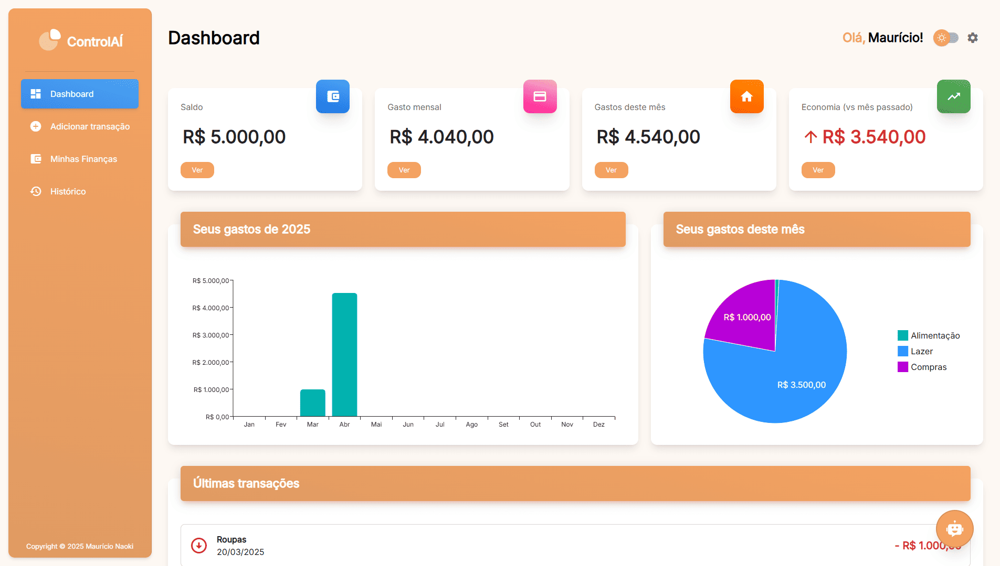
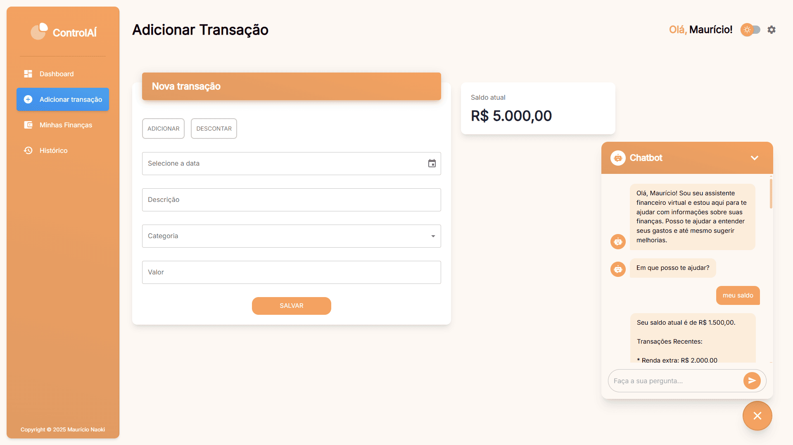
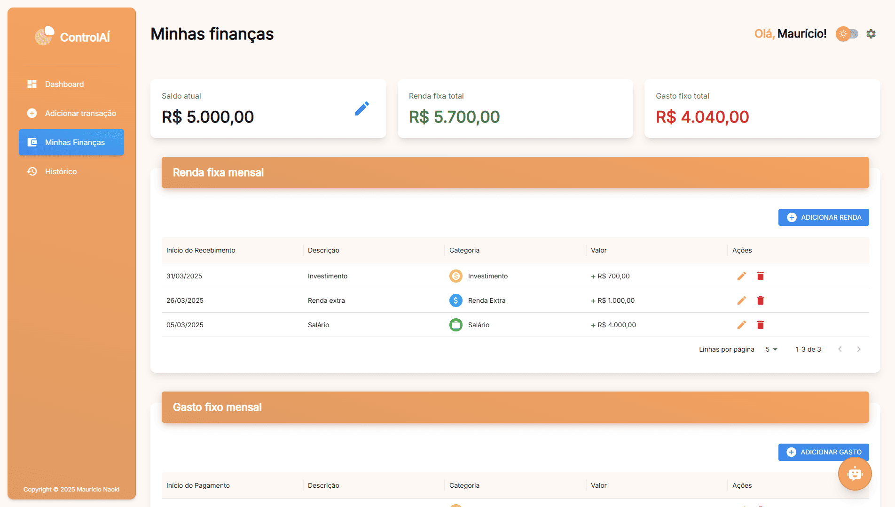
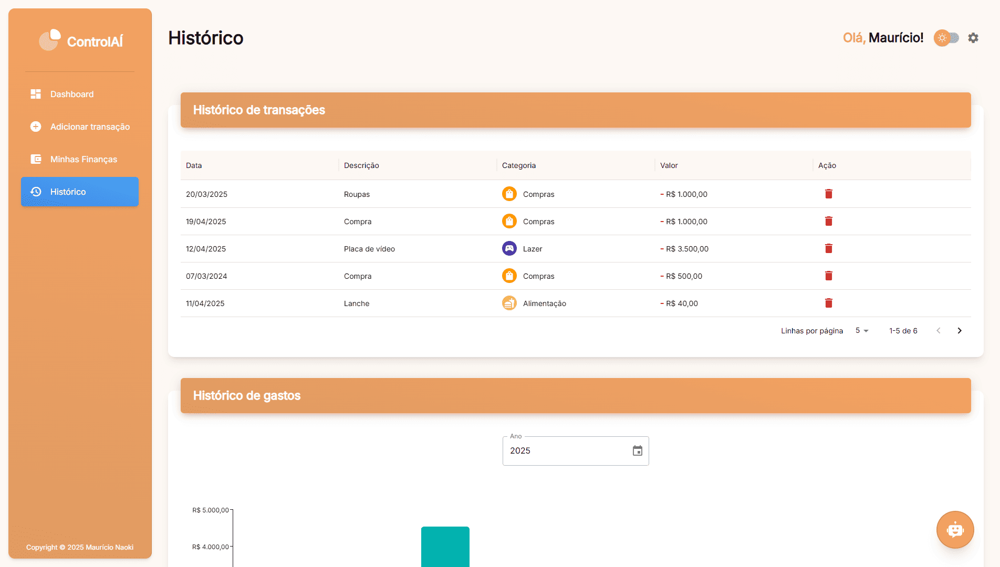
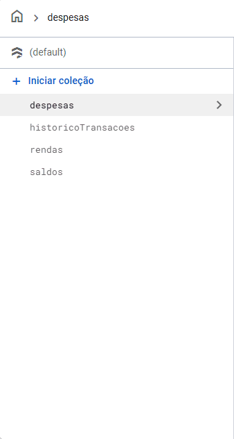
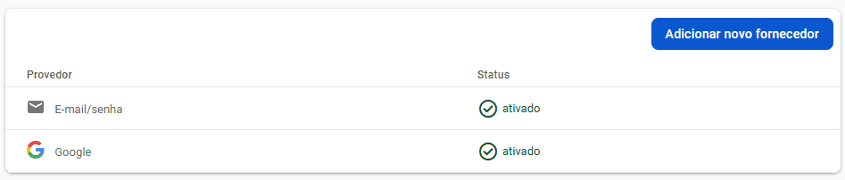

<div align="center"> <h1>ControlAÍ</h1> </div>

<p align="center">
  Se controla aí! Um sistema para organização financeira com suporte de um chatbot integrado com inteligência artificial!
</p>

<p align="center">
  
  
  
  
  
</p>

## 📝 Sobre o projeto

O **ControlAÍ** é um sistema para organização das finanças pessoais, desenvolvido com foco em praticidade e usabilidade. Ele permite acompanhar de forma simples como o dinheiro está sendo gasto, além de mostrar os dados de forma visual com gráficos feitos usando Material UI.

Com ele, você pode, por exemplo:

- Registrar e categorizar despesas e rendas

- Adicionar novas transações

- Comparar seus gastos com os meses anteriores

- Acompanhar seu saldo

- Visualizar dados financeiros com gráficos claros e intuitivos

- Consultar o histórico completo de movimentações

E o diferencial: o projeto conta com um **chatbot integrado à Gemini**, a IA da Google, que pode dar sugestões sobre seus gastos, responder dúvidas e ajudar no controle financeiro com base nas suas transações.

## 🛠 Tecnologias utilizadas

-   **React.js** - Biblioteca JavaScript para construção de interfaces
-   **Material UI** - Conjunto de componentes de interface baseados no Material Design
-   **Cypress** - Ferramenta para testes automatizados end-to-end em aplicações web
-   **Vite** - Ferramenta de build rápida para desenvolvimento front-end
-   **Firebase** - Plataforma do Google com serviços para autenticação, banco de dados e hosting
-   **Node.js** - Ambiente de execução JavaScript no lado do servidor
-   **JavaScript** - Linguagem de programação para desenvolvimento web
-   **HTML** - Linguagem de marcação que estrutura o conteúdo na web
-   **CSS** - Responsável pela aparência e layout das interfaces

## 🧪 Testes automatizados

Utilizei o Cypress para criar testes end-to-end que simulam a interação real do usuário. Esses testes ajudam a validar os principais fluxos da aplicação, identificando possíveis falhas antes da publicação e contribuindo para a estabilidade e confiabilidade do sistema.

## 🔥 Firebase

O projeto utiliza o Firebase para autenticação de usuários, gerenciamento de sessões e hospedagem. Além disso, a plataforma oferece uma solução prática para armazenar e consultar dados, o que facilitou bastante a organização das informações financeiras no sistema.

## 🤔 Por que optei por usar um backend no meu projeto frontend?

Durante o desenvolvimento da funcionalidade com a **API da Gemini**, percebi que, ao fazer requisições diretamente do frontend, a chave de API acabava ficando exposta no código. Isso representa um risco de segurança, já que qualquer pessoa poderia reutilizar a chave e consumir os recursos da API indevidamente.

Para contornar esse problema, implementei uma camada backend com **Node.js**, onde as requisições para a Gemini são tratadas com segurança. 

## 📸 Screenshots

<p align="center">
  
</p>

<p align="center">
  
</p>

<p align="center">
  
</p>

<p align="center">
  
</p>

## 🌐 Acesse o projeto online
Você pode acessar a versão online do projeto [aqui](https://control-ai-ma.vercel.app).

## 🖥️ Como configurar o projeto

Siga os passos abaixo para instalar e executar o projeto em seu ambiente local:

### 1. Clone o repositório:

```bash
$ git clone https://github.com/mauricio071/ControlAI
```

### 2. Acesse o diretório do projeto:

```bash
$ cd ControlAI
```

### 3. Instale as dependências necessárias:

```bash
$ yarn install
```

### 4. Configure as variáveis de ambiente:

O projeto possui dois arquivos .env, um no front-end e outro no back-end.

#### 4.1. Front-end:

Crie um projeto no Firebase ([Vídeo tutorial](https://www.youtube.com/watch?v=C2upiyk85dE&ab_channel=CharlesNicollas)) para gerar as chaves e insira no .env do front-end:

```env
VITE_FIREBASE_API_KEY=
VITE_FIREBASE_AUTH_DOMAIN=
VITE_FIREBASE_PROJECT_ID=
VITE_FIREBASE_APP_ID=
VITE_GEMINI_API=http://localhost:5000/api/gemini
```

No Firebase, será necessário configurar as coleções no Firestore para armazenar os dados da aplicação. Abaixo, um exemplo visual de como a estrutura das coleções deve ficar:



Também será necessário configurar os métodos de autenticação. Para isso, ative as opções de login com Google e e-mail/senha na aba **Authentication** do Firebase:



#### 4.2. Back-end:

Crie uma chave no Google AI Studio ([Vídeo tutorial](https://www.youtube.com/watch?v=o8iyrtQyrZM&ab_channel=RohaneHamilton)) e insira no .env do back-end:

```env
PORT=5000
GEMINI_API=
```

### 5. Inicie o projeto:

```bash 
$ yarn dev
```
Agora você pode acessar o projeto no navegador em http://localhost:5173 (ou na porta indicada pelo terminal).

> 💡 Este projeto já está configurado para rodar front e back-end com um único comando! Caso prefira executar separadamente, acesse as pastas correspondentes.

---

### Para executar os testes automatizados (Cypress):

Execute o comando abaixo no terminal:

```bash 
$ yarn cypress
```
A interface do Cypress será aberta, e você poderá selecionar os testes e acompanhar a execução de forma visual e interativa.
